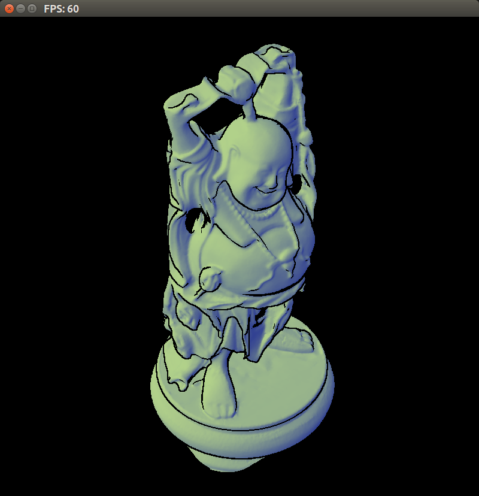
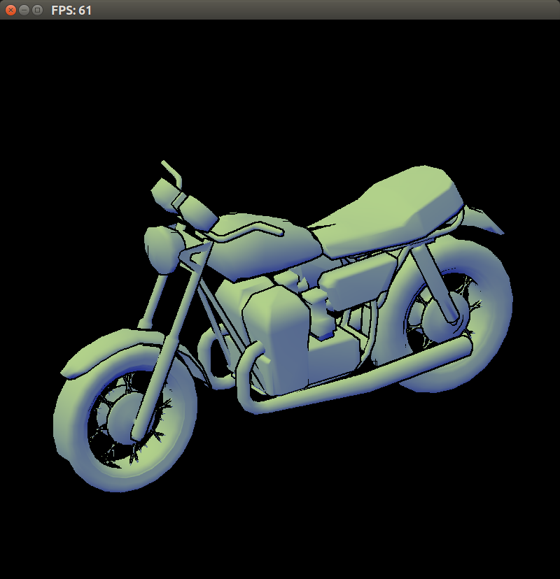
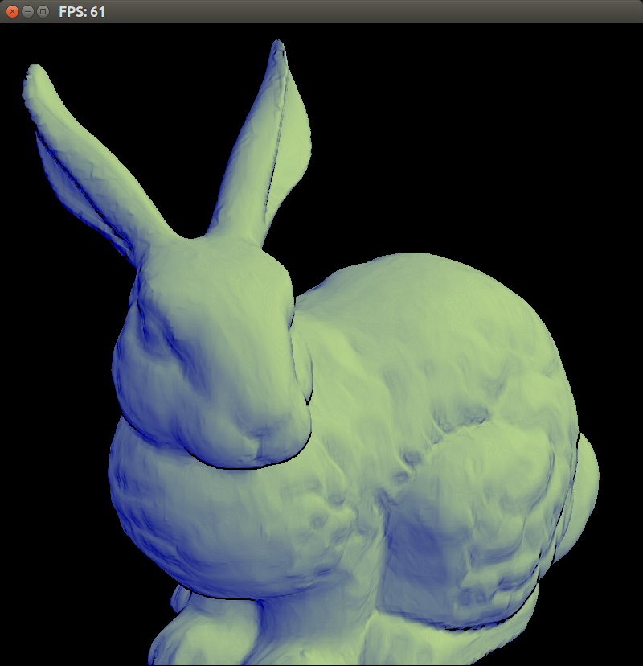
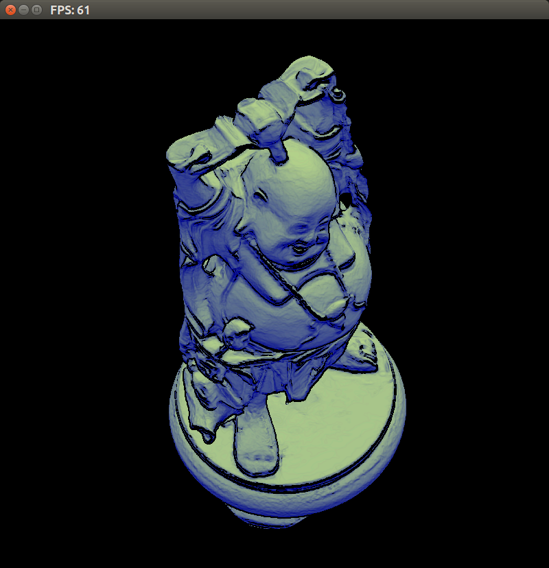
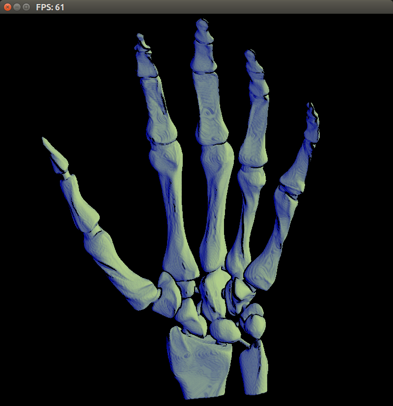
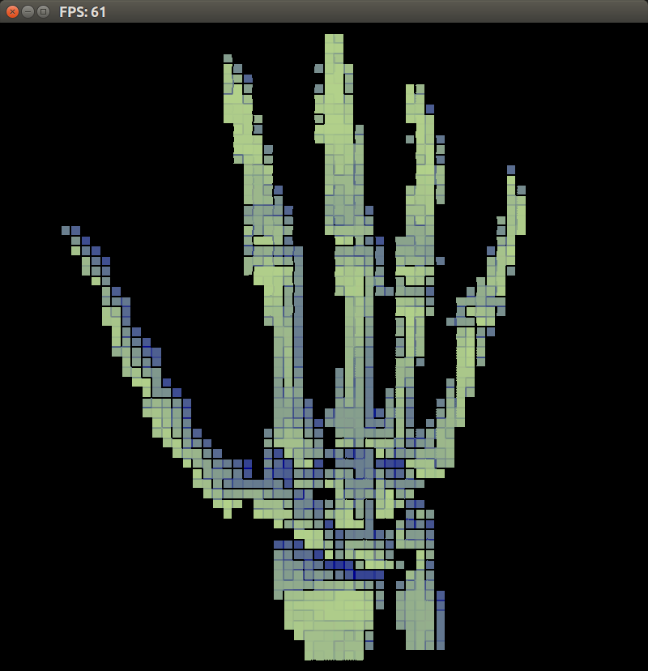
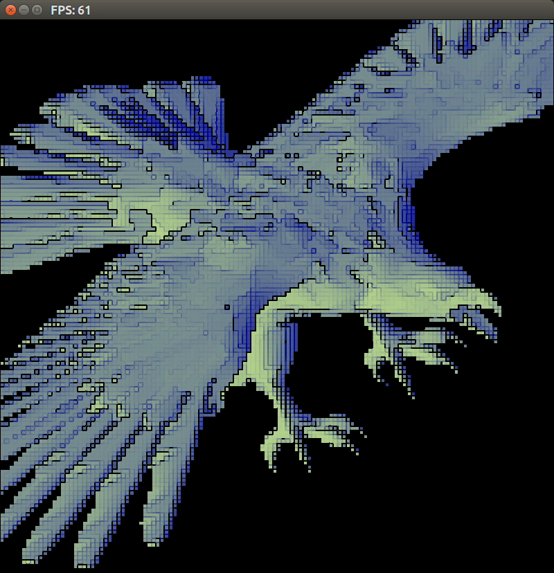

# Non-photorealistic Rendering

A pretty vanilla implementation of NPR in openGL 3.3,
done for CSCI 544 Advanced Computer Graphics Spring 2014, at the
Colorado School of Mines, Project 5.

Based on this paper:

http://www.cs.northwestern.edu/~ago820/SIG98/gooch98.pdf

Models that work with the viewer code can be found here:

- small:
  https://mega.co.nz/#!Kd5UibqC!0vRlRhSZmsGAzNqChEXqulxFHjhE4qaRLtWWd2fGGG0
- medium:
  https://mega.co.nz/#!LdQzjTBZ!GHzKOWa8Zhx357IT8_I5sQj3HQuOZavj35lumDOXUx4
- small + medium + large:
  https://mega.co.nz/#!3FJFVKBL!ri59V_SLqz1GkHu8uUW9lZvmfEax85CfV_bxhqXVT1o

# Screenshots

Using the sobel filter on the depth texture:

Earlier screenshots used the sobel filter on the color pixels instead of
the depth map, for slightly worse results.

As a side effect of how outlines are drawn (sobel filter in texture space, but
_after_ scaling), turning down the resolution from the first pass results in
some neat looking images (with nearest neighbor sampling).

# Running

Compile with:

    make

Then run the viewer:

    ./viewer <model file>
